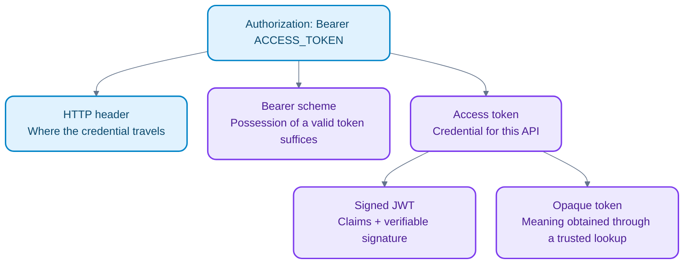
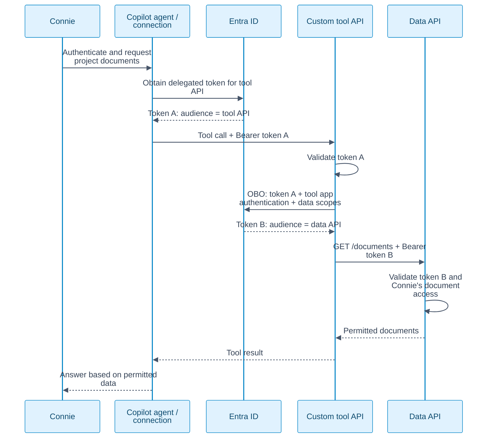
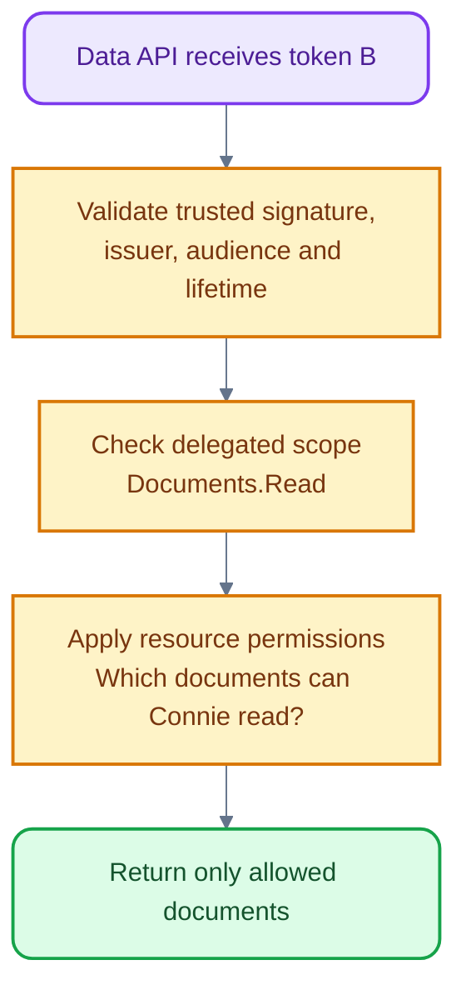

My goal: manage users in **Microsoft Entra ID**, configure a **Copilot Studio agent**, and let its tools access data **on the signed-in user's behalf**.

One example throughout: Connie asks the agent, **“Show my project documents.”** The agent should retrieve only documents Connie is allowed to read.

## 1. Why: preserve the user's access boundary

| Step | What it establishes | What it does not establish |
|---|---|---|
| Maker signs into Copilot Studio | Permission to build/manage an agent | Each end user's downstream data access |
| Register/configure the agent and integrations | Application identity, API permissions, authentication settings | Automatic consent or access to every resource |
| End user authenticates to the published agent | User identity for the conversation | A universal token for all tools |
| Tool authenticates with end-user credentials | Delegated access to the target service | Permission to read every document |

Configure tools for **user authentication** when access must follow the caller. Maker-provided connections instead use the maker's access. Exact setup depends on the channel and connector. [Tool authentication](https://learn.microsoft.com/en-us/microsoft-copilot-studio/configure-enduser-authentication) · [Agent identities and registration](https://learn.microsoft.com/en-us/microsoft-copilot-studio/govern-agents-identities-overview)

## 2. What: header, Bearer, JWT

Illustrative tool request over HTTPS; `ACCESS_TOKEN` is a placeholder:

```http
GET /documents HTTP/1.1
Host: data.example.com
Accept: application/json
Authorization: Bearer ACCESS_TOKEN
```

**Diagram colors:** blue = request/service, purple = token, amber = validation, green = permitted result.



| Term | Meaning |
|---|---|
| Header | Named message metadata; `Authorization` carries credentials, `Accept` states a response preference |
| Bearer | No separate proof of a cryptographic key; the receiver still validates token and permissions |
| JWT | JSON Web Token: a claims format, distinct from how it is transported |
| Signed JWT | Usually `header.payload.signature`; readable encoding, not encryption |

A JWT can be a bearer token; a bearer token need not be a JWT. HTTPS protects transport. [HTTP](https://httpwg.org/specs/rfc9110.html#fields) · [Bearer](https://www.rfc-editor.org/rfc/rfc6750#section-1.2) · [JWT](https://www.rfc-editor.org/rfc/rfc7519)

## 3. How: carry user context, acquire the right token

**Preserve delegation through the chain; do not blindly forward the same token to every service.** Each resource validates that the token's audience (`aud`) identifies that resource.

This is an illustrative **custom tool API → downstream data API** architecture using Entra's On-Behalf-Of (OBO) flow. It is not a claim that every Copilot Studio connector uses this exact sequence.



| Situation | Correct token handling |
|---|---|
| Connector calls the data API directly | Acquire a delegated access token for that data API |
| Custom tool API calls a different data API | Validate its incoming token; acquire a downstream token through configured OBO |
| Token is intended for another API | Reject it; a valid signature does not fix the wrong audience |

OBO requires suitable app configuration, consent, and a user access token intended for the middle tier. An app-only token cannot become a user-delegated token through standard OBO. [Entra OBO flow](https://learn.microsoft.com/en-us/entra/identity-platform/v2-oauth2-on-behalf-of-flow)

Copilot Studio conversation authentication and tool connections are separate configuration concerns. `User.AccessToken` is available with **Authenticate manually**, not **Authenticate with Microsoft**; its presence does not make it valid for an arbitrary API. Use the supported authentication path for the chosen channel/tool. [Agent authentication options](https://learn.microsoft.com/en-us/microsoft-copilot-studio/configuration-end-user-authentication)

## 4. Example: scope is only part of the permission check

Scopes are defined by the resource API and requested/consented through Entra. A user's group membership or data access is not the same thing as an OAuth scope.



Illustrative decoded claims for **our own custom data API**, not a literal Entra token:

```json
{
  "aud": "DATA_API_CLIENT_ID",
  "iss": "https://login.microsoftonline.com/TENANT_ID/v2.0",
  "tid": "TENANT_ID",
  "oid": "CONNIE_OBJECT_ID",
  "scp": "Documents.Read",
  "exp": 1791154800
}
```

| Claim | Question answered |
|---|---|
| `aud` | Which API may accept this token? |
| `iss` / `tid` | Which issuer and tenant issued it? |
| `oid` + `tid` | Which tenant user is represented? |
| `scp` | Which delegated scopes were granted? Entra uses `scp`, not a generic `scope` claim |
| `exp` | When does it expire? Unix time in seconds |

Token format and claims depend on resource/version. APIs validate tokens intended for themselves; clients should treat other APIs' tokens as opaque. [Entra claims reference](https://learn.microsoft.com/en-us/entra/identity-platform/access-token-claims-reference)

| Boundary | Owner |
|---|---|
| Identity, token issuance, consent and identity policies | Entra ID |
| Requested API scopes and configured delegated permissions | API definition + client configuration + consent |
| Record/document access and business rules | Data service or application authorization |
| Tool choice and response generation | Agent; it must not override the data service's checks |

Delegated access is constrained by both granted application permissions and the user's resource access, with policy checks also applying. A read scope grants an operation, not ownership of all data. [Permissions and consent](https://learn.microsoft.com/en-us/entra/identity-platform/permissions-consent-overview)

## 5. Analogy: a visitor badge and room passes

| In a building | In our agent flow |
|---|---|
| Reception verifies Connie | Entra authenticates the user |
| Agreed place to present a pass | HTTP `Authorization` header |
| Holder of a valid pass can use it | Bearer rule |
| Pass details with a verifiable seal | Signed JWT |
| Exchange a reception pass for a room-specific pass | Acquire a token for a new API audience |
| Room guard checks permitted activities and rooms | API checks scope and resource permissions |

## Related terms to recognize

| Term | Connection to this story |
|---|---|
| Authentication / authorization | Establish identity / decide allowed actions |
| App registration / service principal | Application definition / its identity in a tenant; distinct from the user |
| Delegated / application permissions | Act with a signed-in user / act as an application without a user |
| OAuth 2.0 / OIDC | API authorization / an identity layer for user sign-in |
| Access / ID / refresh token | API credential / sign-in information for the client / obtain new access tokens |
| OBO | Middle tier obtains a downstream token while preserving user delegation |
| `kid` / JWKS | Key identifier / key set from a trusted issuer used for signature verification |
| `Content-Type` / `WWW-Authenticate` | Body format / authentication challenge from an API |
| Cookie / session | Browser state transport / application state connecting requests; separate from JWT format |

**Keep tokens in the authentication layer, out of prompts and logs.** Signed payloads are readable; stolen valid bearer tokens can be replayed. Logout or refresh-token revocation does not automatically invalidate every existing access token.

Adapted from the supplied *Bearer Token vs JWT* artifact and the Entra + Copilot Studio scenario above.
