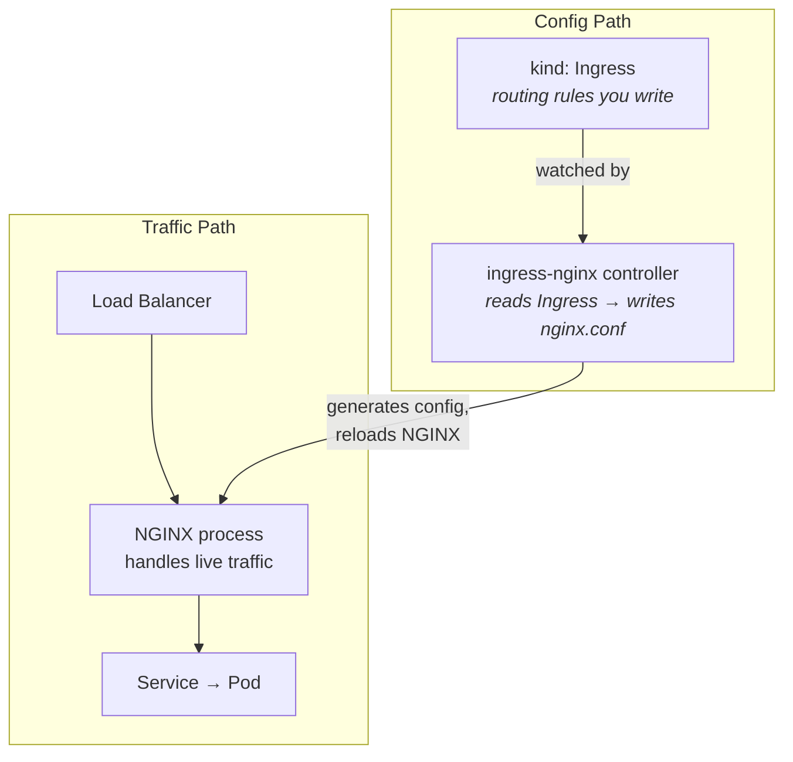
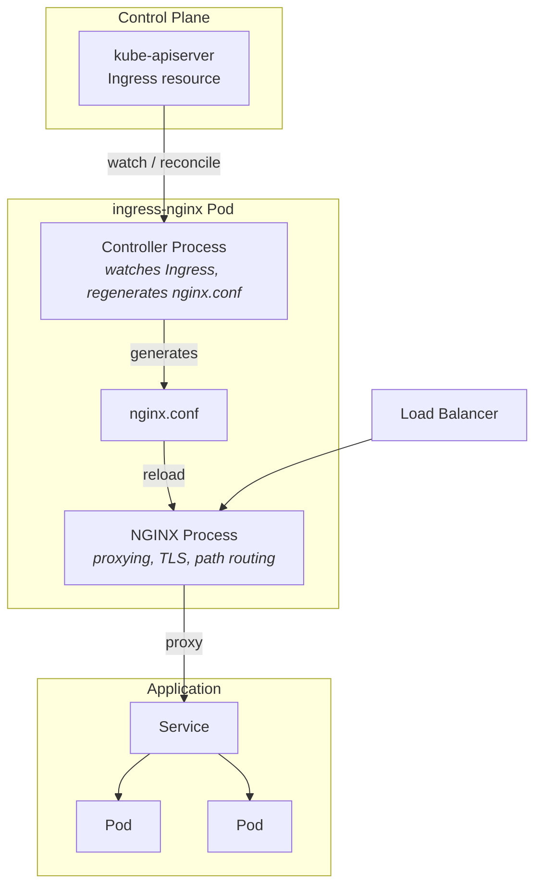
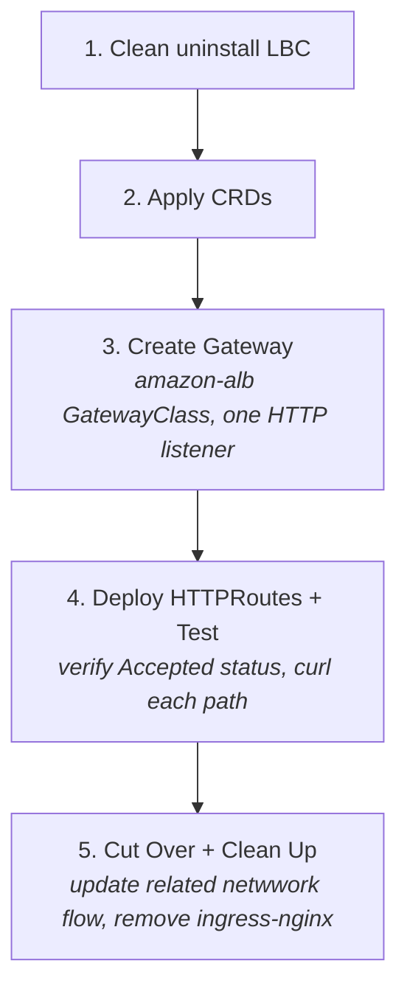

## Introduction

In March 2026, `kubernetes/ingress-nginx` [reaches end-of-life](https://kubernetes.io/blog/2026/01/29/ingress-nginx-statement/) due to security debt and maintainer gap. If you're running it in production, you need a plan. This post covers our migration to **AWS Load Balancer Controller with Gateway API** on Amazon EKS — what we hit, what worked, and lessons learned.

---

## Part 1: Key Terminology

Before anything else — these names cause real confusion ([reference](https://opensource.googleblog.com/2026/02/the-end-of-an-era-transitioning-away-from-ingress-nginx.html)):

| | **Ingress API** | **ingress-nginx** | **NGINX Ingress Controller** |
|---|---|---|---|
| **Repo** | [kubernetes/kubernetes](https://github.com/kubernetes/kubernetes/tree/master/staging/src/k8s.io/api/networking/v1) | [kubernetes/ingress-nginx](https://github.com/kubernetes/ingress-nginx) | [nginx/kubernetes-ingress](https://github.com/nginx/kubernetes-ingress) |
| **Owner** | Kubernetes (SIG Network) | Kubernetes community (volunteers) | F5 / NGINX Inc. |
| **Analogy** | The menu | The chef — reads the menu and cooks | A different restaurant, same sign |
| **What it does** | Declares routing rules — `kind: Ingress` is just a config object | Watches Ingress objects, writes `nginx.conf`, reloads NGINX | Same concept, separate codebase, still maintained |
| **Status** | Feature-frozen | **Going EOL March 2026** | Actively maintained |

---

**How all three work together** — config path (top) vs. traffic path (bottom):



The **Ingress API** is the spec. **ingress-nginx** is what reads it and makes traffic work. Without the controller, the Ingress object does nothing.

---

## Part 2: How ingress-nginx Works

Inside a single pod, two processes handle everything — the controller reconciles config, NGINX serves traffic:



---

## Part 3: Evaluating Migration Options

When ingress-nginx EOL was announced, we evaluated three options:

| Option | Pros | Cons | Decision |
|--------|------|------|----------|
| **NGINX Gateway Fabric** | Same NGINX proxy, familiar patterns | Vendor extensions, still manage NGINX | Overkill |
| **AWS Load Balancer Controller** | Native AWS, no proxy layer | AWS-specific | ✅ Our choice |
| **Istio / Traefik / Envoy** | Various benefits | Too heavy or too new | Not suitable |

### Why We Chose AWS Load Balancer Controller

Three factors made this an easy decision for us:

1. **No advanced NGINX usage** — we weren't using custom snippets
2. **All-AWS infrastructure** — EKS, ALB — native integration was a feature, not a constraint
3. **Strong community** — active development, extensive documentation, large EKS adoption

If you rely heavily on NGINX-specific features, NGINX Gateway Fabric might be the right choice. For a vanilla AWS shop, AWS LBC with Gateway API is the cleaner path.

---

## Part 4: Understanding Gateway API

Gateway API is the next generation of Kubernetes Ingress — an official Kubernetes project focused on L4 and L7 routing. Unlike Ingress (a single resource owned by one team), Gateway API is **role-oriented**: each resource type maps to a different team's responsibility.


### Role-Oriented Design

Each resource belongs to a different persona:

| Resource | Role | Owns |
|---|---|---|
| `GatewayClass` | Infrastructure Provider / Platform team | Defines which controller handles traffic (e.g. `amazon-alb`) |
| `Gateway` | Cluster Operator / SRE | Provisions the actual load balancer — ports, protocols, TLS |
| `HTTPRoute` | Application Developer | Defines path-based routing rules per app |


**Analogy:** Think of it like a building. `GatewayClass` is the building type (office, residential). `Gateway` is a specific floor with an entrance. `HTTPRoute` is the room a visitor gets directed to.

The key insight that confused me initially: **one Gateway (one ALB) can serve many HTTPRoutes (many applications)**. You don't create a new load balancer per app — you create a new route that attaches to the existing Gateway.

---

## Part 5: The Challenges


### Challenge 1: Enabling Gateway API on an Existing Installation

We had AWS LBC old version installed but not actively routing traffic. Gateway API L7/ALB support was added in **v2.14.0** (beta) and reached GA in **v3.0.0**.

Enabling it requires two things:
1. Apply [Gateway API CRDs](https://kubernetes-sigs.github.io/aws-load-balancer-controller/latest/guide/gateway/gateway/) from the Kubernetes SIG
2. Set `enableGatewayAPI: true` in the Helm values

**Our solution: clean reinstall**

Since our LBC wasn't handling production traffic, we chose to uninstall and reinstall cleanly rather than update CRDs and toggle flags in-place — less risk of partial state. See the [installation guide](https://kubernetes-sigs.github.io/aws-load-balancer-controller/latest/deploy/installation/) for full steps.

> If your LBC is actively handling production traffic, use a parallel deployment instead: install fresh in a separate namespace with Gateway API enabled, migrate services one by one, then remove the old controller only after all traffic is moved.

---

### Challenge 2: Path Rewriting Rules

Our initial concern was whether Gateway API could handle path-based sub-path routing cleanly—NGINX made this easy with annotations, and we weren't sure the new approach would hold up. It does, just differently.

```yaml
# NGINX approach — proxy strips the prefix
annotations:
  nginx.ingress.kubernetes.io/rewrite-target: /$2
  nginx.ingress.kubernetes.io/use-regex: "true"
```

**Gateway API's philosophy is different:** configure the *application* to be path-aware, not the gateway to rewrite paths.

```yaml
# Grafana Helm values — tell Grafana its root URL
grafana:
  grafana.ini:
    server:
      root_url: https://monitoring.example.com/grafana
      serve_from_sub_path: true
```

With that configured, the HTTPRoute needs no filters at all — just forward the request as-is:

<details>
<summary>HTTPRoute manifests</summary>

```yaml
apiVersion: gateway.networking.k8s.io/v1
kind: HTTPRoute
metadata:
  name: grafana
  namespace: system
spec:
  parentRefs:
    - name: my-gateway
      namespace: kube-system
  rules:
    - matches:
        - path:
            type: PathPrefix
            value: /grafana
      backendRefs:
        - name: grafana
          port: 8080
---
apiVersion: gateway.networking.k8s.io/v1
kind: HTTPRoute
metadata:
  name: prometheus
  namespace: system
spec:
  parentRefs:
    - name: my-gateway
      namespace: kube-system
  rules:
    - matches:
        - path:
            type: PathPrefix
            value: /prometheus

      backendRefs:
        - name: prometheus-server
          port: 9090
```

</details>

### Challenge 3: Regex Path Matching Broken

During testing, some routes required `RegularExpression` path matching in HTTPRoute. The controller was silently using glob matching instead, causing validation errors like:

```
Condition value '/some/path/[a-z]+/subresource*' contains a character that is not valid.
```

The root cause: the controller was sending `values` to the ALB API instead of `regexValues` for regex path conditions — so regex rules were never actually applied.

There was no workaround. My colleague filed [this issue](https://github.com/kubernetes-sigs/aws-load-balancer-controller/issues/4573), and the fix landed in **v3.1.0** very quickly. This is where an active community really matters.

---

## Part 6: Implementation Walkthrough



---

## Part 7: Migration Tool

Before writing Gateway API manifests from scratch, use [ingress2gateway](https://github.com/kubernetes-sigs/ingress2gateway) — the official Kubernetes SIG tool that converts existing Ingress resources to Gateway API equivalents:

```bash
./ingress2gateway print --providers=ingress-nginx
```

This reads your existing Ingress objects and outputs equivalent `Gateway` and `HTTPRoute` YAML. Convert the output into your IaC (Helm/CDK/Terraform) and validate in a lower environment first. Useful if you have many Ingress rules and want a starting point rather than writing from scratch.

## Conclusion

With Gateway API in place and a clear role hierarchy, I find it's really clean. And we also can visually see all resources, health check from AWS console, which make debug so easy.

If you're on AWS and don't have complex NGINX customizations, this migration is the right call. Just go in with eyes open and test out.

**Resources:**
- [AWS LBC Installation Guide](https://kubernetes-sigs.github.io/aws-load-balancer-controller/latest/deploy/installation/)
- [CDK EKS Blueprints v1.17.3 IAM Policy](https://github.com/awslabs/cdk-eks-blueprints/blob/blueprints-1.17.3/lib/addons/aws-loadbalancer-controller/iam-policy.ts)
- [Gateway API Documentation](https://gateway-api.sigs.k8s.io/)
- [ingress2gateway Migration Tool](https://github.com/kubernetes-sigs/ingress2gateway)
- [The End of an Era: Transitioning Away from Ingress NGINX](https://opensource.googleblog.com/2026/02/the-end-of-an-era-transitioning-away-from-ingress-nginx.html)
